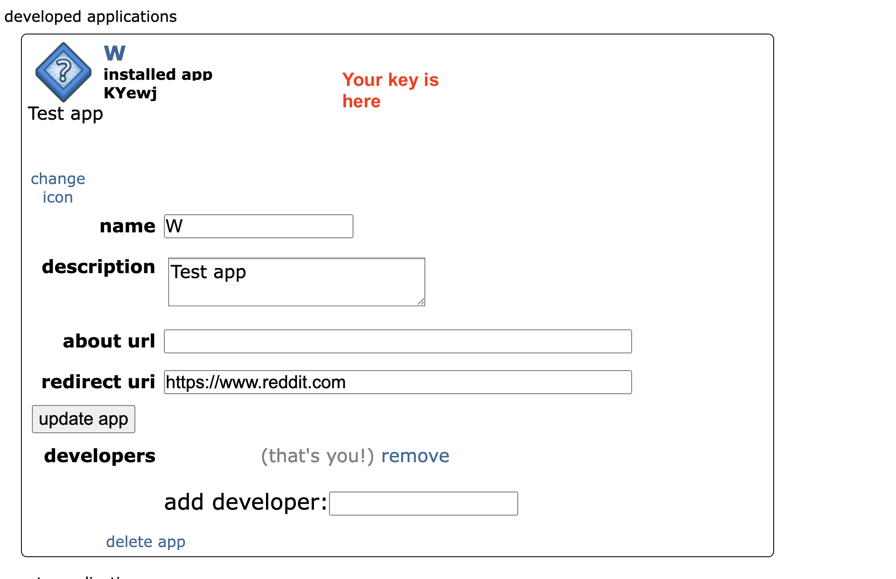

# Api key

Please, create and app on Reddit https://www.reddit.com/prefs/apps.
Please create it as an **installed app**, put any url in **about url** and **redirect url**.



Then grab the key.

Create a file named `apikey.properties` in the root of the project and put the following line in it:

```
CLIENT_ID="your key here"
```

